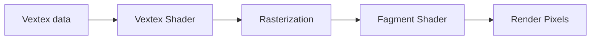

# The graphics piple, the magic behind any AAA video game

OpenGL is a graphics API in C that allow us to communicate the CPU with the GPU, sending large batches of geometric data so the GPU’s multi processing capabilities can transform them into pixels.  The graphics pipeline is the process of transforming (mapping) the 3D data sent to the GPU into a 2D coordinate system to be displayed into a screen. The vertex is the single unit of data, which holds attributes (3D coordinates, color values, normals, among other) that allow the pipeline lo render those vertices into the screen in the form of pixels.

## Over simplification of the process


## How to set and use OpenGL’s states?

This graphics library is an state machine, which means that it will maintain its state until something else is specified. e.g is a pixel is set to red, it will maintain that given state until otherwise. It offers two types of methods; **state-setting** and **state-using** functions. 

```csharp
glClearColor(0.0f, 0.0f, 0.0f, 1.0f); //State-setting
glClear(GL_COLOR_BUFFER_BIT); //State-using function
```

## Is it all OpenGL 3D? (Viewer - Object)

There is a fundamental different between rasterizing pixels on the screen and representing 3D coordinates into a 2D view port. We need a viewer and an object to represent an image into the screen. In this context the viewer is a synthetic agent we call camera, and the object is any geometry that is within the field of view of the viewer. Many graphics libraries and game engines use the same model, they at least one camera on the scene, and the objects (GameObjects in Unity or the Actors Unreal).

## Coordinate system [-1 , 1]

OpenGL coordinate system consist of 3 axis, X, Y and Z, with normalized device coordinates that go from `[-1, 1]` . All the vertices within this domain will be evaluated to be render on the screen. If a vertex has coordinates outside this domain, the rasterization process will clip that information from the view port.

## How fast is this process? (Double Buffer)

Fragments of a seconds, nonetheless, not all pixels are shaded at once, the GPU set pixels from in lines from left to right and top and bottom. Which create artefacts on the screen, a flickering affect. OpenGL has a trick to solve this using a double buffer. The first buffer, is the front buffer that we see on the screen, is the old image formed in a previous frame step. The second buffer, or back buffer, is where the GPU is actually setting the new fragments one by one. Once the back buffer is done, OpenGL swaps between them, show the final result to the screen.

```csharp
glfwSwapBuffers(window);
```

## References
[1] De Vries J.Learn OpenGL. Recover 2024 https://learnopengl.com/ 
