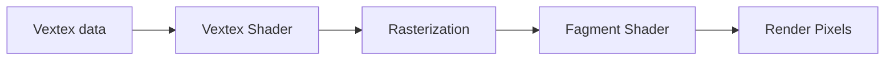

# The graphics pipeline
*The magic behind any AAA video game*

OpenGL is a graphics API in C that allows us to communicate the CPU with the GPU, sending large batches of geometric data so the GPU’s multi-processing capabilities can transform them into pixels.  The graphics pipeline is the process of transforming (mapping) the 3D data sent to the GPU into a 2D coordinate system to be displayed on a screen. The vertex is the single unit of data, which holds attributes (3D coordinates, color values, normals, among others) that allow the pipeline to render those vertices into the screen in the form of pixels.

## Oversimplification of the process


## How do you set and use OpenGL’s states?

This graphics library is a state machine, which means that it will maintain its state until something else is specified. For example, if a pixel is set to red, it will maintain that given state until otherwise. It offers two types of methods: **state-setting** and **state-using** functions. 

```csharp
glClearColor(0.0f, 0.0f, 0.0f, 1.0f); //State-setting
glClear(GL_COLOR_BUFFER_BIT); //State-using function
```
<br/>

## Is it all OpenGL 3D? (Viewer - Object)

There is a fundamental difference between rasterizing pixels on the screen and representing 3D coordinates into a 2D viewport. We need a viewer and an object to represent an image on the screen. In this context, the viewer is a synthetic agent we call a camera, and the object is any geometry within the viewer's field of view. Many graphics libraries and game engines use the same model: they have at least one camera on the scene and objects (GameObjects in Unity or the Actors Unreal).
<br/>
## Coordinate system [-1 , 1]
OpenGL coordinate system consists of 3 axes, X, Y, and Z, with normalized device coordinates that go from `[-1, 1]` . All the vertices within this domain will be evaluated to be render on the screen. If a vertex has coordinates outside this domain, the rasterization process will clip that information from the viewport.
<br/>
## How fast is this process? (Double Buffer)
It is blasting fast, fragments of a second. Nonetheless, not all pixels are shaded at once; the GPU sets pixels in lines from left to right and top and bottom. Which creates artifacts on the screen, a flickering effect. OpenGL has a trick to solve this using a double buffer. The first buffer, or front buffer, that we see on the screen, is the old image formed in a previous frame step. The second buffer, or back buffer, is where the GPU is actually setting the new fragments one by one. Once the back buffer is done, OpenGL swaps between them and shows the final result to the screen. The former front buffer is now ready to be overwritten with the new information on the next frame.

```csharp
glfwSwapBuffers(window);
```
<br/>
## References
[1] De Vries J.Learn OpenGL. Recover 2024 https://learnopengl.com/ 
